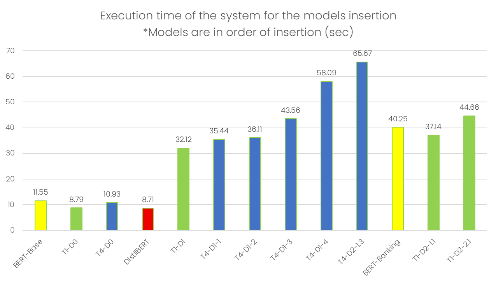

# Model Heritage Clustering System Documentation

This document describes the comprehensive clustering system implemented for the Model Heritage Backend.

## Overview

The clustering system provides automatic model family assignment using sophisticated distance calculation, clustering algorithms, and centroid representation.

## Architecture

### Core Components

1. **ModelDistanceCalculator** (`src/clustering/distance_calculator.py`)
   - Calculates distances between AI/ML model weights
   - Supports multiple distance metrics (L2, matrix rank, cosine similarity)*
   - The focus is on the full fine-tuned operation

2. **FamilyClusteringSystem** (`src/clustering/family_clustering.py`)
   - Assigns models to families based on weight similarities
   - Maintains family centroids and statistics
   - Supports multiple clustering algorithms (DBSCAN, K-means, threshold-based)*
   - Uses configurable distance thresholds*

3. **MoTHerTreeBuilder** (`src/clustering/tree_builder.py`)
   - Builds genealogical trees within model families
   - Uses kurtosis-based direction determination
   - Applies Edmonds' algorithm for minimum directed spanning tree
   - Supports different tree building methods*

4. **ModelManagementSystem** (`src/clustering/model_management.py`)
   - Coordinates all clustering components*
   - Manages complete pipeline from upload to heritage detection*
   - Provides comprehensive genealogy queries*

### MoTHer Algorithm Compatibility

The system leverages the existing MoTHer algorithm implementation:
- Reuses `load_model_weights`, `calc_ku`, `calculate_l2_distance` from `mother_utils.py`
- Uses existing `build_tree` function for tree construction
- Maintains compatibility with current parent-finding logic

## Configuration Options

### Distance Metrics
```python
DistanceMetric.L2_DISTANCE       # Standard L2 norm (default for full models)
DistanceMetric.MATRIX_RANK       # Matrix rank analysis (optimal for LoRA)
DistanceMetric.COSINE_SIMILARITY # Cosine similarity
DistanceMetric.AUTO              # Auto-select based on model type
```

### Possible clustering Methods
```python
ClusteringMethod.DBSCAN      # Density-based clustering
ClusteringMethod.KMEANS      # K-means clustering
ClusteringMethod.THRESHOLD   # Simple threshold-based
ClusteringMethod.AUTO        # Auto-select based on data size
```

### Tree Building Methods
```python
TreeBuildingMethod.MOTHER        # Full MoTHer algorithm (kurtosis + distance)
```

## Performance Considerations

### Memory Usage*

### Processing Time*



### Key Metrics to Monitor*
- Family size distribution
- Processing success rate
- Average confidence scores
- Tree validity metrics

## Dependencies

### Required Packages
- `numpy>=1.21.0` - Numerical computations
- `scipy>=1.7.0` - Scientific computing
- `scikit-learn>=1.0.0` - Machine learning algorithms
- `networkx>=2.6` - Graph operations
- `torch>=1.9.0` - PyTorch tensors
- `pandas>=1.3.0` - Data manipulation

### Optional Packages
- `safetensors>=0.3.0` - Safe tensor serialization
- `transformers>=4.20.0` - Hugging Face models support

## License and Attribution

This clustering system builds upon the MoTHer algorithm implementation and cooperate with the Model Heritage Backend architecture. 